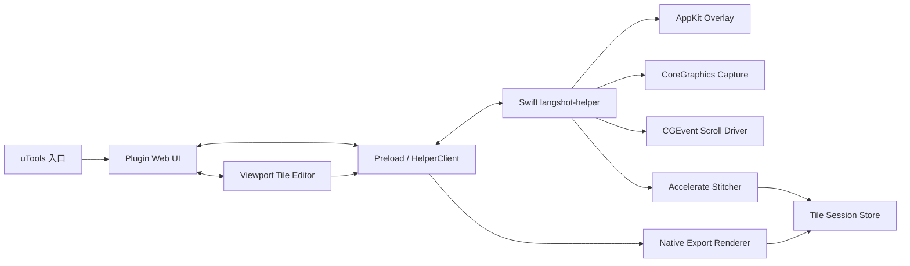

# langShot 技术设计

## 事实与约束

- 仓库从空目录开始，没有需要兼容的既有代码或数据格式。
- 本机为 Apple Silicon、macOS 15.5，已安装 uTools 7.8.0 和 Swift 6.1.2 Command Line Tools，但未安装完整 Xcode。
- 产品必须覆盖 macOS 10.15，因此不能把 ScreenCaptureKit（macOS 12.3+）作为唯一截图实现。
- uTools 负责插件入口和截图后 UI；系统级透明覆盖层、全局事件和目标应用捕获必须由原生 helper 完成。
- 最长图为 60,000 物理像素；Chromium 单画布纹理上限和连续 RGBA 内存均不适合直接承载整图。
- 插件目标体积小于 20MB，且不允许上传截图或引入依赖云服务。

## Goals

- 在普通屏和 Retina 屏上得到未降采样、可验证的像素结果。
- 让手动与自动滚动共享同一采集、匹配和恢复模型。
- 对固定 UI、低纹理、动态页面和权限/进程失败提供显式恢复路径。
- 以有界内存完成 60,000px 拼接、预览、标注和导出。
- 让原生与 Web 模块可分别测试，并用版本化契约集成。

## Non-goals

- 跨屏或二维拼接、任意方向回退合并、DRM 内容绕过。
- 使用 OCR/视觉模型理解页面语义。
- 为每个目标应用注入脚本或安装浏览器扩展。
- 在第一轮设计中承诺证书、商店审核或商业发布渠道。

## Architecture

插件目录只包含 UI、preload、协议类型和生命周期控制。`langshot-helper.app` 是无 Dock 图标的 agent application，拥有独立 bundle identifier 和权限归属；其可执行文件由 Swift Package 产出后包装进 `.app`。helper 通过 stdin/stdout JSON Lines 与唯一父插件通信，不监听网络端口。

## Decisions

### D1. AppKit helper 而非纯 Electron 覆盖层

**Choice**

使用 Swift/AppKit 创建每块屏幕对应的无边框 `NSPanel`，选定后只保留目标屏覆盖层；用原生事件监视器处理拖拽、键盘和状态控件。

**Rationale**

AppKit 能稳定覆盖其他应用、处理多显示器坐标，并把权限、滚动事件和捕获放在同一进程，避免 Electron 窗口焦点改变目标滚动容器。

**Alternatives**

- Electron 全屏窗口：系统级事件和 z-order 行为依赖 uTools 主进程，不可控。
- `screencapture -i`：选区流程不可扩展，无法持续动态调整。

**Consequences**

需要维护 Swift 与 TypeScript 两套模块；helper 的权限说明、bundle id 和签名必须稳定。

### D2. CoreGraphics 兼容捕获路径

**Choice**

最低系统路径使用 `CGWindowListCreateImage` 的 `.optionOnScreenBelowWindow`，以覆盖层窗口为层级边界捕获其下方内容，并请求 `.bestResolution`。所有 point 坐标先绑定 `NSScreen`，再通过显示器 scale 与实际 `CGImage` 尺寸校验为物理像素矩形。macOS 12.3+ 可在验证一致后增加 ScreenCaptureKit 优化，但不改变协议。

**Rationale**

该路径覆盖 10.15，能在单个顶层覆盖窗下排除 langShot UI，不需要在采样时隐藏/显示造成闪烁。

**Alternatives**

- `CGDisplayCreateImageForRect`：简单，但难以保证排除覆盖层。
- 仅 ScreenCaptureKit：无法满足 10.15。
- 每帧隐藏覆盖层：产生可见闪烁和竞态。

**Consequences**

必须在真实普通屏/Retina/混合缩放环境验证坐标；若系统版本对 below-window 语义异常，会话应失败而不是捕获覆盖层。

### D3. JSON Lines 子进程协议

**Choice**

preload 以 `child_process.spawn` 启动 helper；stdin/stdout 传输 UTF-8 JSON Lines。每条消息含 `protocolVersion`、`type`、`requestId`，事件另含 `sessionId` 和单调递增 `sequence`。stderr 仅输出不含截图内容的诊断日志。

核心命令包括 `hello`、`permissions.get/request/openSettings`、`session.begin`、`selection.*`、`scroll.anchor/setSpeed`、`session.pause/resume/finish/discard`、`editor.export` 和 `session.recover`。核心事件包括 `state.changed`、`selection.changed`、`progress`、`pause.required`、`completed` 和 `error`。

**Rationale**

子进程管道天然限制为父子关系，无端口暴露，便于记录和夹具测试；控制消息体积小，图像只通过受控会话文件传递。

**Alternatives**

- Unix Domain Socket：支持重连但增加地址、权限和清理问题。
- HTTP localhost：暴露额外攻击面且不符合纯本地最小协议。
- Base64 图像进 JSON：内存和复制开销不可接受。

**Consequences**

协议必须处理半行、坏行、请求超时和进程退出；预览文件只可通过 `(sessionId, tileId)` 白名单读取，UI 不能传入任意本地路径。

### D4. 显式、可恢复的会话状态机

**Choice**

helper 是会话状态的唯一权威。状态转换表在 Swift 中以纯 reducer 表达并由单元测试覆盖；插件只渲染状态和发送意图。每次接受帧后先写临时清单并原子 rename，再发布进度事件。

**Rationale**

暂停、二次 Esc、方向反转、到底、超时和 helper 重启都要求一致恢复语义；让两个进程分别推断状态会产生竞态。

**Alternatives**

- UI 驱动的布尔状态：组合爆炸且无法可靠恢复。
- 只在完成时写文件：崩溃会丢失所有有效采集。

**Consequences**

每条命令需声明允许状态；会话目录包含带 schema 版本和校验的 `manifest.json`。

### D5. 位移驱动采样与自动滚动锚点

**Choice**

手动模式以 10Hz 为目标轮询捕获低分辨率探针；探针检测到足够同向新内容后才提交无损全帧。自动模式使用 `CGEvent` 向锚点坐标发送滚轮事件，速度映射为事件间隔和增量的有界组合；焦点应用、显示器或锚点失效立即暂停。

**Rationale**

位移驱动避免慢速时漏内容和静止时重复帧；锚点比猜测嵌套滚动容器可靠，也不依赖每个应用的 Accessibility 控件树。

**Alternatives**

- 固定时间提交所有帧：产生大量重复数据。
- Accessibility 自动寻找 scroll area：跨 Electron、WebView 和自绘控件不稳定。
- 应用注入：超出权限和兼容范围。

**Consequences**

自动滚动仍需辅助功能权限；速度上限必须确保相邻提交帧有足够重叠。

### D6. Accelerate 多带匹配与静止掩码

**Choice**

匹配流水线先将共同横向区域转换为 1/4 或 1/8 灰度探针，计算行梯度特征；在方向约束的位移窗口中使用 Accelerate/vDSP 归一化相关，对左、中、右多条内容带分别投票。候选位移需满足分数、峰值间隔和多带一致性。跨至少三帧在屏幕坐标不变的像素带形成静止掩码，不参与位移投票；顶部固定带最终合成于顶部，底部固定带合成于底部，侧向固定带按画布规则只保留一份。

**Rationale**

无需引入 OpenCV，可利用系统库控制插件体积；多带投票比整帧单相关更能抵抗固定栏和重复纹理。

**Alternatives**

- OpenCV 特征匹配：二进制体积和 Universal 打包成本高。
- 单列像素比较：对空白和动态内容脆弱。
- OCR/DOM：不能覆盖所有目标应用。

**Consequences**

动画、视频、大面积纯色仍可能低置信度；设计明确暂停让用户继续、完成或丢弃，不做危险猜测。

### D7. Tile-backed 原始画布和预览金字塔

**Choice**

会话目录按固定高度（初始 1024px，可基准调整）的无损 tile 保存 BGRA/PNG 数据和校验；拼接器只保留当前帧、前一帧探针、活动 tile 和小型静止模型。完成时生成多级预览 tiles。Web 编辑器仅加载可视区域的预览 tile；裁剪和标注始终使用原始像素坐标。

**Rationale**

1440×60,000 RGBA 单份约 330MB，多份画布会越过 500MB；Chromium 也无法保证 60,000px 单 canvas。分块同时解决内存、恢复和 viewport 渲染。

**Alternatives**

- 完整连续位图：实现简单但内存不可接受。
- 只保存每帧：导出时重复计算且恢复清单复杂。
- 把预览当最终图：违反高清要求。

**Consequences**

导出必须流式逐条带渲染，操作坐标需经过统一变换库；临时目录要有配额和过期清理。

### D8. Web 非破坏性编辑，Native 最终渲染

**Choice**

TypeScript 编辑器保存矢量操作列表、马赛克区域和 crop rect，使用 viewport canvas 组合预览；导出时把版本化 edit document 发送给 helper。helper 以 CoreGraphics 按输出条带读取原始 tiles、重放标注和马赛克并编码。PNG/JPEG 使用 ImageIO；WebP 优先运行时 ImageIO 支持，否则使用体积受控的 bundled libwebp 编码器。

**Rationale**

Web UI 适合高频编辑交互，native 流式渲染能绕过浏览器大画布限制并保持原始像素。

**Alternatives**

- 全部在 Web canvas 导出：尺寸和内存不可控。
- 全原生编辑器：实现周期长且与 uTools 体验割裂。
- 使用 `sharp`：Universal 原生模块和包体积负担较高。

**Consequences**

Web 与 Swift 必须共享编辑文档 schema 和黄金图测试；WebP fallback 必须通过 20MB 包体门禁，不能满足时需回到产品决策而非静默取消格式。

### D9. 开发、Universal 与签名分层

**Choice**

`scripts/build-native.sh` 分别构建 arm64/x86_64 并 `lipo`，包装 helper app；`scripts/package-plugin.sh` 生成开发包并检查大小；`scripts/sign-and-notarize.sh` 只有检测到显式凭据时才签名、公证和 staple。CI/本地验证使用 `lipo -info`、`otool` 和 `codesign --verify`。

**Rationale**

当前没有完整 Xcode 和证书，但不能让开发构建被发布凭据阻塞；正式路径仍需提前固化，避免临发布才修改 bundle 结构。

**Alternatives**

- 只做 Xcode project：当前环境无法完整运行且生成文件噪声大。
- 只做未签名脚本：无法证明正式分发路径。

**Consequences**

Swift Package 是源码权威；正式公证验收要等完整 Xcode 与证书可用后完成。

## Data and Coordinate Model

- `DisplayDescriptor`：display ID、全局 point bounds、物理 pixel size、scale、rotation。
- `SelectionRect`：所属 display ID、全局 point rect、规范化 display-local rect、解析后的 physical pixel rect。
- `FrameRecord`：frame ID、时间、selection、tile references、probe hash、accepted offset、confidence。
- `SessionManifest`：schema/protocol version、mode、direction、state、canvas X union、effective height、static bands、frame records、checksums。
- `EditDocument`：版本、crop rect、ordered operations、样式、背景色、输出参数。

坐标转换集中在一个纯函数模块，并采用左上角原始像素坐标作为跨语言持久化标准；AppKit/Quartz 的坐标差异只在边界适配层处理。

## Security and Privacy

- helper 不开放网络监听，不包含上传代码；构建检查搜索网络依赖和 endpoint。
- preload 只暴露枚举化 API，不向 renderer 暴露 `child_process`、任意文件读写或 shell。
- 自定义输出路径由 uTools/系统选择器产生并规范化；helper 只接受带 request-scoped authorization 的具体文件路径。
- 日志严禁帧数据、base64、OCR 文本、窗口标题和目标应用可见内容；崩溃恢复目录默认 24 小时过期并允许用户立即清理。

## Risks and Verification Evidence

| 风险 | 影响 | 缓解 | 所需证据 |
|---|---|---|---|
| Catalina 的 CoreGraphics 捕获与新系统行为不同 | 覆盖层进入截图或尺寸错误 | 抽象 capture backend；真实 10.15/现代系统验收 | 普通屏/Retina 黄金截图与 OS 矩阵 |
| 固定栏或动画误导重叠算法 | 重复、断层或错位 | 多带一致性、静止掩码、低置信度暂停 | 合成夹具 + 六应用人工场景 |
| 60,000px 导出越过内存 | 崩溃或系统换页 | tile-backed 合成和条带编码 | 峰值 RSS 基准报告 |
| WebP 在 10.15 支持不足 | 格式缺失 | ImageIO 能力探测 + bundled libwebp fallback | 10.15 解码/编码测试和包体报告 |
| TCC 权限与 bundle/signature 变化 | 重复授权或无法滚动 | 稳定 helper bundle id；开发/正式签名文档 | 权限拒绝、授权、升级测试 |
| uTools 关闭或重载 renderer | helper 泄漏或会话丢失 | parent-death 检测、心跳、原子 manifest | 进程退出与恢复集成测试 |
| Intel 性能较低 | 采样降频 | 正确性优先的自适应探针频率 | Intel 功能矩阵与降频状态事件 |
| 当前缺少完整 Xcode | 无法本轮完成公证 | 分离开发构建与发布门禁 | 开发构建成功；发布步骤标记外部前置条件 |

## Verification Strategy

1. Swift 单元测试：状态机、坐标、协议、匹配、静止带、tile manifest、导出几何。
2. TypeScript 单元测试：协议验证、store、命令门禁、编辑历史、坐标映射、设置迁移。
3. 契约测试：相同 JSON fixtures 由 Swift 与 TypeScript 解码并验证拒绝样例。
4. 黄金图测试：已知滚动偏移、动态宽度、固定顶/底栏、低纹理、动画噪声、向上/向下。
5. 性能测试：1440×60,000，记录帧率、CPU、RSS、磁盘、编码时间和输出 hash/尺寸。
6. 手工系统测试：权限、覆盖层排除、多屏单选、六应用兼容矩阵、uTools 生命周期。
7. 构建测试：Universal 架构、deployment target、包体小于 20MB、未签名路径、凭据存在时签名/公证路径。
